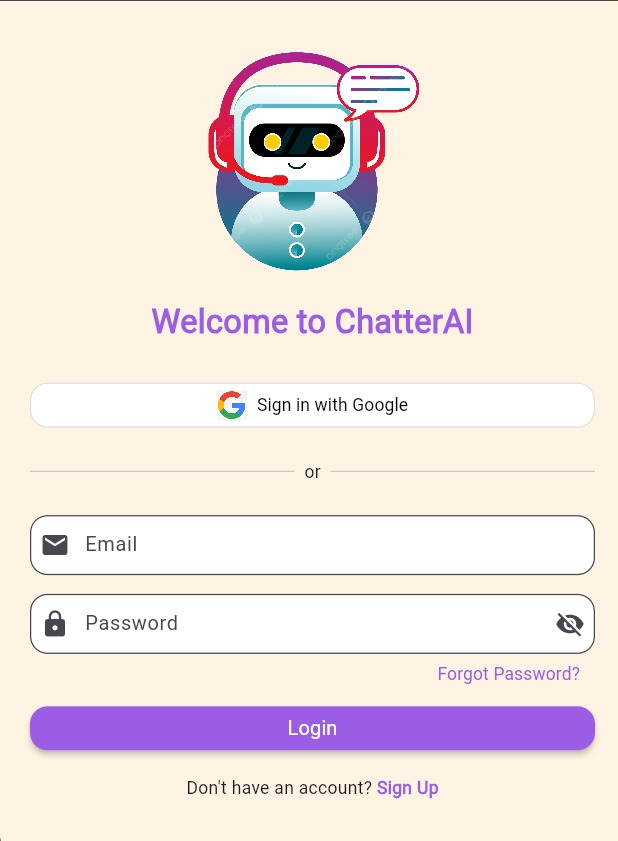
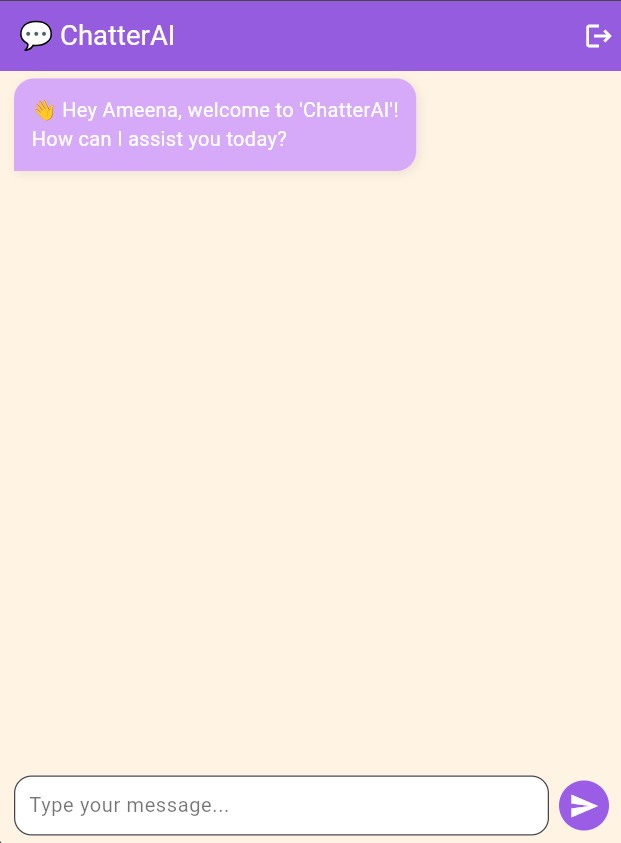
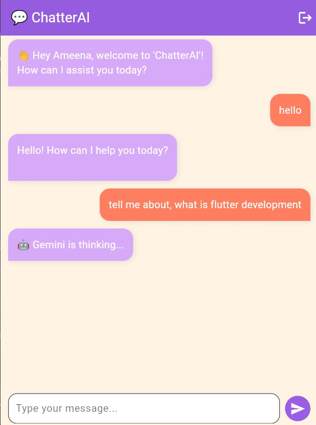
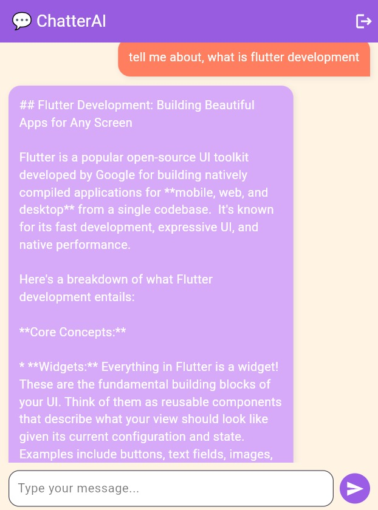

<h1 align="center"> ChatterAI</h1>

  

---

  <b>ChatterAI</b> is a <b>smart chatbot app</b> built using <b>Flutter</b> and <b>Firebase</b>. 
  It integrates <b>Gemini API</b> to power real-time intelligent responses. 
  The app allows users to <b>sign up, log in, chat with the AI bot, and reset passwords</b> — all with a sleek, modern UI.

---

<h3 align="center"> The UI Looks Like This</h3>

  
  
  
  

---

<h3 align="center"> Developed By</h3>

  <b>Ameena Begum</b>

